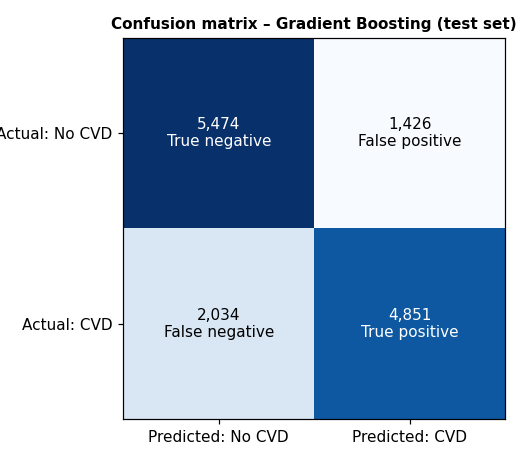
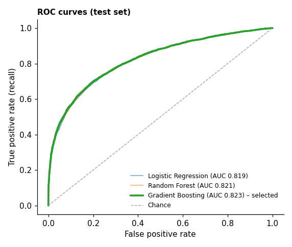

# 🫀 PulsePredict


**An end-to-end cardiovascular risk analytics platform:** raw data → cleaning & EDA → model comparison → saved sklearn pipeline → validated FastAPI service → SQLite logging → Streamlit dashboard, with automated tests and CI.

> ⚠️ **Educational portfolio project – not a medical diagnostic system.** Outputs are model estimates learned from a training dataset, not a personal probability of disease.

<!-- Add your own screenshots to docs/screenshots/ and link them here once you've run the dashboard:
 -->

## Features

- **Data pipeline** – validation, documented cleaning rules (every removed row is counted), feature engineering (age in years, BMI).
- **Three compared models** – Logistic Regression (baseline), Random Forest, Gradient Boosting; selection by cross-validated ROC-AUC, not accuracy alone.
- **One saved pipeline** – preprocessing + model are a single scikit-learn `Pipeline`, so serving uses exactly the training transformations.
- **FastAPI backend** – Pydantic input validation (`age = -400` is rejected with HTTP 422), `/health`, `/predict`, `/stats`, auto-generated `/docs`.
- **SQLite logging** – every successful prediction is logged (output only – no inputs stored).
- **Streamlit dashboard** – Overview, Data Explorer, Model Performance, Risk Prediction (with internal analytics).
- **Tests + CI** – 24 pytest tests, GitHub Actions on every push / PR.

## Architecture

```
Raw CSV ──► validate + clean (src/data.py) ──► split ──► Pipeline: BMI → scale/encode → model (src/preprocessing.py, src/train.py)
                                                              │
                                                  models/pulsepredict_pipeline.joblib
                                                              │
Streamlit (dashboard/app.py) ──HTTP JSON──► FastAPI (api/main.py) ──► Pydantic validation ──► predict_proba()
                                                              │
                                                       SQLite (src/database.py)
```

## Dataset

The project is built around the schema of the public Kaggle **“Cardiovascular Disease dataset”** (70,000 records: age in days, gender, height, weight, systolic/diastolic BP, cholesterol, glucose, smoking, alcohol, activity, `cardio` target).

**Important:** the CSV bundled in this repository (`data/raw/cardio_train.csv`) is a **synthetic stand-in** generated by `src/synthetic.py` with the same schema and realistic data-quality problems (duplicates, impossible blood pressures, implausible heights/weights). It contains **no real patient data**, and the metrics below describe how models behave on *this synthetic data*, not on real patients.
To use the real dataset: download `cardio_train.csv` from Kaggle, place it at `data/raw/cardio_train.csv`, then run `python -m src.train`. Nothing else needs to change (the README tables below should then be updated from `outputs/metrics/`).

## Data preprocessing

Rules live in `src/data.py` and are reported in `outputs/metrics/cleaning_report.json`:

| Rule | Rows removed |
|---|---|
| Duplicate observations (ignoring id) | 25 |
| Height outside 120–220 cm | 105 |
| Weight outside 30–250 kg | 105 |
| Systolic BP outside 70–250 mmHg | 521 |
| Diastolic BP outside 40–150 mmHg | 181 |
| Systolic ≤ diastolic | 138 |
| **Total** | **1,075 of 70,000 (1.54%)** |

Limits are physiological-plausibility bounds (e.g. a systolic of 16020 is a typing error), **not** percentile trimming, which would discard genuine hypertensive patients. Age is converted from days to years and `BMI = weight / height²`.
Train/test split happens **before** any transformer is fitted; scaling/encoding are learned from the training data only.

## Machine-learning approach

Stratified 80/20 split → three models inside the same `Pipeline` → 5-fold cross-validated ROC-AUC on the **training** split → the final model is chosen from CV results (the test set is only used for reporting). If candidates are within 0.001 CV-AUC of each other the simpler one wins (the tolerance is a judgement call; see `src/train.py`).

## Model results (held-out test set, synthetic data)

| Model | Accuracy | Precision | Recall | F1 | ROC-AUC |
|---|---|---|---|---|---|
| Logistic Regression | 0.743 | 0.753 | 0.723 | 0.737 | 0.819 |
| Random Forest | 0.747 | 0.774 | 0.699 | 0.734 | 0.821 |
| **Gradient Boosting (selected)** | **0.749** | **0.773** | **0.705** | **0.737** | **0.823** |

Differences between models are small. Gradient Boosting had the best cross-validated ROC-AUC (0.826 ± 0.004). In a screening context a **false negative** (higher-risk profile labelled lower-risk) is generally costlier than a **false positive**, so recall and ROC-AUC are considered alongside accuracy; the decision threshold (0.5) could be lowered to trade precision for recall.

| Confusion matrix | ROC curves |
|---|---|
|  |  |

Feature importance (permutation, model-agnostic): `outputs/figures/feature_importance.png`.

## API

```bash
uvicorn api.main:app --reload       # http://localhost:8000/docs
```

| Method | Path | Purpose |
|---|---|---|
| GET | `/` | API info |
| GET | `/health` | `{"status": "healthy", "model_loaded": true}` |
| POST | `/predict` | Validate → predict → log → respond |
| GET | `/stats` | Aggregates + recent rows from the SQLite log |

```bash
curl -X POST http://localhost:8000/predict -H "Content-Type: application/json" -d '{
  "age": 45, "sex": 2, "height": 170, "weight": 78, "systolic_bp": 135, "diastolic_bp": 85,
  "cholesterol": 1, "glucose": 1, "smoking": 0, "alcohol": 0, "active": 1 }'
```
Returns `prediction`, `risk_category`, `probability`, `model_version` (+ disclaimer). Coding: `sex` 1 = female, 2 = male; `cholesterol`/`glucose` 1 = normal, 2 = above normal, 3 = well above normal.

## Dashboard

```bash
streamlit run dashboard/app.py      # http://localhost:8501  (start the API first)
```
Pages: **Overview** (KPIs + pipeline), **Data Explorer** (8 charts + dataset summary + cleaning table), **Model Performance** (comparison, confusion matrix, ROC, importance, selection rationale), **Risk Prediction** (form → API, plus SQLite analytics).

## Testing

```bash
pytest -v
```
24 tests: data cleaning rules, preprocessing/pipeline, SQLite logging, and the API (200 for valid input; 422 for out-of-range, missing, invalid-category and systolic ≤ diastolic input; response fields; probability ∈ [0, 1]; health; logging only on success). GitHub Actions runs them on every push and pull request.

## Installation

Requires **Python 3.11+**.

```bash
git clone https://github.com/stackcraftio/PulsePredict.git
cd PulsePredict
python -m venv .venv && source .venv/bin/activate     # Windows: .venv\Scripts\activate
pip install -r requirements.txt

python -m src.train                  # optional: regenerates cleaned data, metrics, figures and the model
uvicorn api.main:app --reload        # terminal 1
streamlit run dashboard/app.py       # terminal 2
```

## Repository layout

```
api/         FastAPI app + Pydantic schemas
dashboard/   Streamlit app
src/         config, data cleaning, preprocessing, EDA, training, evaluation, inference, database, synthetic data
tests/       pytest suite
notebooks/   01_eda.ipynb
models/      pulsepredict_pipeline.joblib
outputs/     figures/ and metrics/ produced by training
docs/        HOW_IT_WORKS.md
```

## Limitations

- Trained on a (here synthetic) dataset of adults aged ~30–65; predictions outside that range are extrapolation.
- Associations in the data are not causal and not individual medical risk. Self-reported/limited features (no family history, lipid panel values, medications, etc.).
- Model output is not calibrated against real-world outcomes and has not been clinically validated.
- Only the decision threshold 0.5 is evaluated; no fairness analysis across sex/age subgroups.
- SQLite log is single-node and intended for demonstration.

## Future improvements

Probability calibration and threshold tuning for a recall target; subgroup fairness analysis; SHAP explanations; model/experiment tracking; containerisation and cloud deployment; drift monitoring on logged inputs.

## License

MIT – see [LICENSE](LICENSE).

## Screenshots


